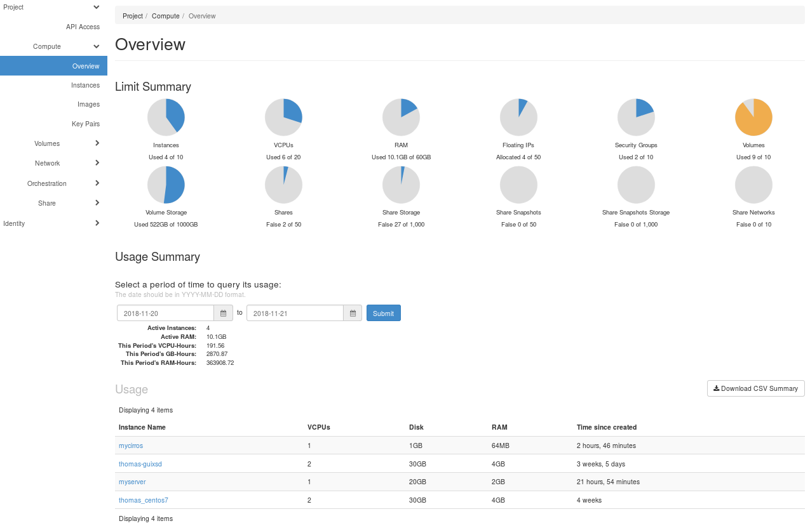

# The OpenStack Dashboard

After login, you can see the Overview tab of
_Horizon_, the
_OpenStack Dashboard_.

This chapter briefly describes the different components of the
dashboard. You can read the official documentation at
[docs.openstack.org](https://docs.openstack.org/horizon/latest/user/).

The VSC cloud uses a customized dashboard. Some features mentioned in
the official OpenStack documentation were intentionally removed, please
contact if you need access to one of these disabled features.

## Project tab

Resources (instances, data volumes, networks, ...) in OpenStack are
organized into different projects, and every user is a member of one or
more projects. Every project member has full access to all of the
project's resources.

From the Project tab, you can access the following categories:

**API Access** View API endpoints.

**Compute**

 -   Overview: View reports for the project.
 -   Instances: View, launch, create a snapshot from, stop, pause, or
     reboot instances, or connect to them through VNC.

 -   Images: View images and instance snapshots created by project
    users, plus any images that are publicly available. Create,
    edit, and delete images, and launch instances from images and
    snapshots.

 -   Key Pairs: View, create, edit, import, and delete key pairs.

 -   Server Groups: Server groups provide a mechanism to group
        servers according to certain policy.

**Volumes**

 -   Volumes: View, create, edit, and delete volumes.

 -   Snapshots: View, create, edit, and delete volume snapshots.

**Network**

 -   Networks: Create and manage public and private networks.

 -   Security Groups: View, create, edit, and delete security groups
     and security group rules..

 -   Floating IPs: Allocate an IP address to or release it from a
     project

**Orchestration**

 -  Stacks: Use the REST API to orchestrate multiple composite cloud
    applications.

 -  Resource types: Show a list of all the supported resource types
    for HOT templates.

 -  Template versions: The version of a Heat template specifies the
    format of the template and also the corresponding features that
    will be validated and supported.

-   Template generator: A graphical interface to build and edit
    templates.

**Shares**

-   Shares: Create and manage share.

## Identity tab

From the Identity tab, you can access the following categories:

**Projects**

View, create, assign users to, remove users from, and delete
projects.

**Users**

View, create, enable, disable, and delete users.

**Application Credentials**

With application credentials, a user can grant applications limited
access to their cloud resources.
