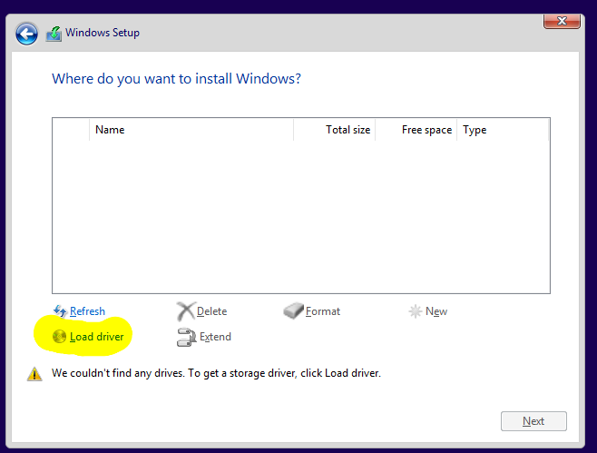
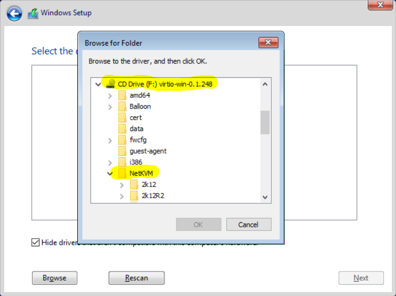
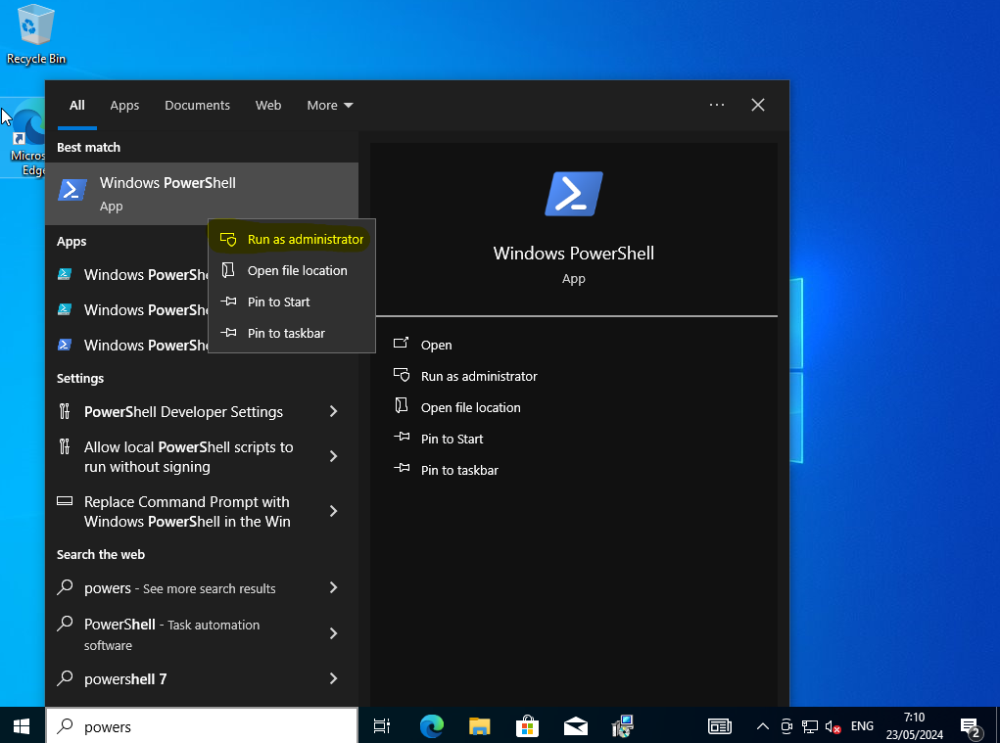

# Running Windows VMs

It is possible to deploy Windows VMs in VSC Tier-1 Cloud infrastructure.
VSC [Terraform modules](terraform.md) 
provides a terraform module with an option for Windows. Simply use the `Windows10` image and set `is_windows = true`. Please read our
[Terraform section](terraform.md) first to know how to use and modify
Terraform modules.

:::{note}
At this moment VSC Tier-1 Cloud only provides a Windows 10 public image.
Windows 11 will be available soon.
:::

## Deploy Windows VM with Terraform

Windows VMs also require some extra steps after the Terraform deployment. After running:

```shell
terraform apply
```
It will take around 7 minutes or more to deploy the new Windows VM (the system
should resize the disk and Windows NTFS partition). Wait until it is done.

## Retrieve Windows admin password

Windows Terraform template generates a random password to login the first time
as Admin user in your Windows VM. 

You can see this password when you run `terraform apply` or `terraform output`.
It will output something like `MyVM = "xfreerdp /u:admin /port:59405 /v:193.190.80.3 /p:yourpassword"`.

You can also retrieve the password from
[VSC Tier-1 Cloud dashboard](https://cloud.vscentrum.be), just login with your
VSC account and go to `Compute->Instances` and click on your Windows `Instance Name`
(by default `MyVM-windows` if you didn't change the name).
Click or select the `Overview` tab, you will see the Windows admin password
(`admin_pass`) from Metadata section below:


:::{warning}
Any user with access to the project can see the password in the metadata of the VM. 
You can change the password in windows settings if necessary. Make sure to write down the password, since we cannot help you reset it if you lose it.
:::

At this point you can use Windows Remote Desktop (RDP) with your new admin user and password
to connect to your VM.
:::{note}
Remember: use `terraform output` to get the connection details for your VM
(please see [Terraform section](terraform.md) for more details).
:::

:::{note}
Take into account you should upgrade your Windows OS after the first boot.
You should activate your Windows machine with a valid key as well.
:::
# Creating your own Windows image
It is possible to customize and upload your own windows image. 
The guide below is a semi-automated method of doing so. 
## Preperation
1) Download the latest stable virtio driver:
https://fedorapeople.org/groups/virt/virtio-win/direct-downloads/stable-virtio/
3) Save as `virtio-win.iso`
4) Download the latest windows iso, save as `Windows.iso`
* [Win10](https://www.microsoft.com/en-us/software-download/windows10ISO)
5) Configure/Download the unattended install iso: [https://schneegans.de/windows/unattend-generator/](https://schneegans.de/windows/unattend-generator/?LanguageMode=Unattended&UILanguage=en-US&UserLocale=nl-BE&KeyboardLayout=0409%3A00000409&GeoLocation=21&ProcessorArchitecture=amd64&BypassRequirementsCheck=true&ComputerNameMode=Custom&ComputerName=openstack&TimeZoneMode=Implicit&PartitionMode=Interactive&WindowsEditionMode=Unattended&WindowsEdition=pro&UserAccountMode=Unattended&AccountName0=Admin&AccountPassword0=&AccountGroup0=Administrators&AutoLogonMode=None&PasswordExpirationMode=Unlimited&LockoutMode=Default&EnableRemoteDesktop=true&DisableAppSuggestions=true&DisableWidgets=true&PreventDeviceEncryption=true&WifiMode=Skip&ExpressSettings=DisableAll&SystemScript0=Set-Content+-Path+C%3A%5CWindows%5Ccloudconfig.ps1+-Value+%22Add-Content+-Path+%27C%3A%5CProgram+Files%5CCloudbase+Solutions%5CCloudbase-Init%5Cconf%5Ccloudbase-init*%27+-Value+%27first_logon_behaviour%3Dno%27%22&SystemScriptType0=Ps1&SystemScript1=pnputil+-i+-a+F%3A%5Cviostor%5Cwin10%5Camd64%5C*.INF&SystemScriptType1=Cmd&SystemScript2=pnputil+-i+-a+F%3A%5Cqxl%5Cw7%5Camd64%5C*.INF&SystemScriptType2=Cmd&SystemScript3=Remove-Partition+-Disknumber+0+-PartitionNumber+%24%28Get-Partition+%7C+Select-Object+-Last+1%29.PartitionNumber+-Confirm%3A%24false&SystemScriptType3=Ps1&FirstLogonScript0=Set-ExecutionPolicy+Unrestricted&FirstLogonScriptType0=Ps1&FirstLogonScript1=Invoke-WebRequest+-UseBasicParsing+https%3A%2F%2Fgithub.com%2Fcloudbase%2Fcloudbase-init%2Freleases%2Fdownload%2F1.1.4%2FCloudbaseInitSetup_1_1_4_x64.msi+-OutFile+cloudbaseinit.msi%3B+cloudbaseinit.msi+&FirstLogonScriptType1=Ps1&WdacMode=Skip)(link includes current configuration)


## Creating the image
Create the disk: 
```
qemu-img create -f qcow2 windows.qcow2 40G
```
Install windows on the disk, mounting all the required drives:
```
virt-install --connect qemu:///system   --name windows --ram 6144 --vcpus 2   --network network=default,model=virtio --disk path=windows.qcow2,format=qcow2,device=disk,bus=virtio --cdrom Windows.iso --disk path=unattend.iso,device=cdrom --disk path=virtio-win.iso,device=cdrom   --vnc --os-variant=win10
```
Or `--os-variant=win11` for win11.

### Windows setup
Most windows setup options are taken care of by `unattend.iso` except the partitioning. 
#### Drivers
In the partitioning window, click `load drivers` and browse to `NetKVM\w10\amd64` on the virtio drive and select that folder. (Obviously select `w11` if on Windows 11), then `next`.




Do the same for `viostor\w10\amd64`. 

You should now have acccess to the internet and be able to see the virtual hard drive. Click `next` and let windows install. 

### Configuring windows
After some time, Windows will start. `unattend.iso` runs these actions:
1) import the viostor drivers (not sure if necessary)
2) enable unrestricted powershell for cloud init
3) Download and run cloudbase cloud-init

Wait for the download to complete.The cloudinit wizard will appear automaticaly. 

Before continuing, make any changes to the OS you would still like to make, as those will be included in the final image. 
When you're ready, follow the install wizard. In the `configuration options` screen, make sure to set COM1 as the logging port. Everything else can be left default.

Before starting sysprep, open powershell as administrator (click start menu, type `powershell` and rightclick) and execute `C:\Windows\cloudconfig.ps1`.


## Uploading the image
Finally, upload the image with 
```
OS_CLOUD=openstack openstack image create --disk-format qcow2 --file windows.qcow2 Windows10-example

```

## Using the image
Make sure to set `is_windows = true` in your VM definition if you're using the terraform templates.